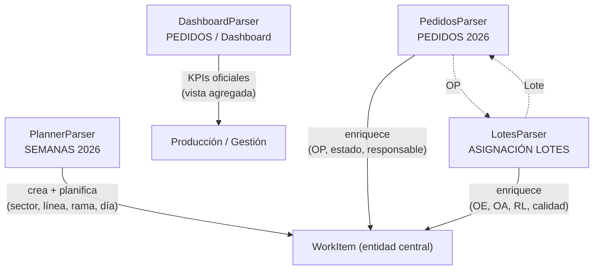

# 30 — Especificación del parser del laboratorio Genus

> **Estado:** Especificación definitiva — **análisis cerrado; implementación en curso**  
> **Versión:** 3.0 (decisiones finales aprobadas)  
> **Fecha:** 2026-07-03  
> **Contexto:** Los Excel compartidos son **referencia estructural únicamente**. La fuente de verdad operativa es **siempre Google Sheets en vivo** vía Drive.

---

## Resumen ejecutivo

Genus OS no debe interpretar Google Sheets como tablas de base de datos. Debe interpretar **cómo opera el laboratorio**.

**Principio del sistema:** el WorkItem es la entidad central de Genus OS. No representa una fila de un Sheet — representa una **unidad real de trabajo del laboratorio**. Todo lo que ocurre en Genus OS ocurre sobre un WorkItem. Los parsers solo enriquecen esa entidad.

El WorkItem **no depende de Google Sheets**. Es una entidad propia del dominio. Los Sheets enriquecen atributos según la fuente oficial de cada campo — **no hay prioridad global entre archivos**.

```text
WorkItem (entidad central)
    ↑ enriquece
PlannerParser      → cuándo, dónde, bloque, línea, rama
    ↑ enriquece
PedidosParser      → OP, cliente, producto, estado, responsable, cantidades
    ↑ enriquece
LotesParser        → lote, OE, OA, análisis, RL, estado calidad
    ↑ contexto
DashboardParser    → KPIs oficiales (consumo, no recálculo)
```

**Objetivo final:** representar la operación real del Laboratorio Genus utilizando Google Sheets como fuente de verdad — no leer Excel, no simular tablas.

---

## 0. Principios invariantes

1. **Google Sheets = única fuente de datos en runtime.**
2. **Excel de referencia = solo para aprender geometría** (tests/fixtures estructurales opcionales; nunca producción).
3. **No hardcodear filas, clientes, productos ni estados.**
4. **No parser genérico.** Un parser por geometría, sin mezclar responsabilidades.
5. **No recalcular KPIs en Next.js.** Consumir Dashboard de PEDIDOS.
6. **No reinventar datos administrativos desde SEMANAS** cuando PEDIDOS ya los tiene.
7. **No duplicar lógica de calidad** fuera de ASIGNACIÓN DE LOTES.
8. **WorkItem ≠ fila de sheet.** Es la proyección operativa enriquecida.

---

## 1. WorkItem — entidad central de Genus OS

### 1.1 Qué es

El **WorkItem** es la unidad de trabajo operativo del laboratorio. Todo lo que una persona ve en `/mi-trabajo` — elaboración, envasado, calidad, producción — son WorkItems enriquecidos.

No es el resultado final de un join entre sheets. **Existe desde el primer contacto con una fuente** y se va completando a medida que los parsers aportan información.

### 1.2 Modelo conceptual

```typescript
// Especificación conceptual — no implementado aún
WorkItem {
  // Identidad
  internalId: string           // ID interno Genus — generado al crear el WorkItem
  op: string | null            // PedidosParser
  loteRef: string | null       // PedidosParser + LotesParser

  // Operación (PlannerParser)
  sector: SectorId             // ELABORACION | ENVASADO_MASIVO | ENVASADO_PREMIUM | CALIDAD | ...
  linea: string | null         // "Línea 1", "Línea 2", … — solo envasado; null en elaboración
  branchOwner: string | null   // "Cristian" | "Nicolás" — solo elaboración
  sectorLead: string | null    // "Santino Gianfilippo" — encargado elaboración

  // Planificación (PlannerParser)
  weekLabel: string | null
  dayOfWeek: string | null
  plannedDate: string | null
  cliente: string | null       // texto planner; PedidosParser puede normalizar
  producto: string | null
  cantidadPlanificada: string | null
  notas: string | null

  // Administrativo (PedidosParser — fuente primaria)
  clienteOficial: string | null
  productoOficial: string | null
  estado: string | null
  responsable: string | null
  cantidadPedida: number | null
  sectorComercial: "M" | "P" | null

  // Calidad (LotesParser — fuente primaria)
  oeRef: string | null
  oaRef: string | null
  fechaAnalisis: string | null
  numeroAnalisis: string | null
  rl: string | null
  estadoCalidad: string | null
  observacionCalidad: string | null

  // Trazabilidad
  enrichmentSources: string[]  // qué parsers ya contribuyeron
  confidence: "high" | "medium" | "low"
  sourceRanges: Record<string, string>  // sheet → rango origen
}
```

### 1.3 Pipeline de enriquecimiento (no construcción al final)

```text
1. WorkItemRegistry vacío

2. PlannerParser
   → detecta bloques operativos en SEMANAS
   → crea WorkItems con internalId + datos de planificación
   → registra sector, línea, rama, día, cliente/producto/cantidad del planner

3. PedidosParser
   → lee PEDIDOS 2026 (OP, cliente, producto, estado, responsable, cantidades)
   → busca WorkItems existentes por OP / lote / internalId
   → enriquece campos administrativos; crea WorkItem si solo existe en PEDIDOS

4. LotesParser
   → lee ASIGNACIÓN DE LOTES (lote, OE, OA, análisis, RL)
   → busca WorkItems por lote / OP / internalId
   → enriquece estado calidad; crea WorkItem si el lote no tenía planificación

5. DashboardParser
   → lee KPIs oficiales del Dashboard de PEDIDOS
   → NO recalcula; expone snapshot para Producción / gestión
   → no muta campos individuales de WorkItem salvo contexto agregado

6. WorkItemRegistry.listForSector(persona)
   → filtros operativos por sector, línea, rama, persona
```

**Regla:** ningún parser reconstruye WorkItems desde cero al final. Cada uno **aporte** a la entidad central.

### 1.4 Jerarquías operativas por sector

#### Elaboración — sin líneas

```text
Encargado: Santino Gianfilippo
    ├── Rama: Cristian
    │       └── Trabajos (WorkItems)
    └── Rama: Nicolás
            └── Trabajos (WorkItems)
```

| Usuario | Vista |
|---------|-------|
| `santino@` | Ambas ramas (Cristian + Nicolás) |
| `cristian@` | Solo rama Cristian |
| `nicolas@` | Solo rama Nicolás |

El parser detecta bloques `CRISTIAN` / `NICOLAS` como delimitadores de rama. Santino no es una fila del sheet; es `sectorLead` aplicado a todo el sector Elaboración.

#### Envasado — sector → línea → trabajo

```text
Sector: Envasado Masivo
    ├── Línea 1 → Trabajos
    ├── Línea 2 → Trabajos
    ├── Línea 3 → Trabajos
    └── Línea 4 (ocasional) → Trabajos

Sector: Envasado Premium
    ├── Línea 1 → Trabajos
    └── Línea 2 (ocasional) → Trabajos
```

**Las líneas NO son sectores.** No crear `ENVASADO_MASIVO_LINEA_2` como sector separado. Un solo sector (`ENVASADO_MASIVO` o `ENVASADO_PREMIUM`) con campo `linea`.

Ejemplo operativo:

```text
Envasado Masivo → Línea 2 → Body Splash Coco
```

El PlannerParser debe detectar encabezados de línea (`LÍNEA 1`, `LINEA 2`, `Línea 3`, variantes) dentro del bloque de sector (`ENVASADO CONSUMO MASIVO` / `ENVASADO PRODUCTOS PREMIUN`).

---

## 2. Fuente oficial por atributo

**No hay prioridad global entre Sheets** (prohibido: `PEDIDOS > LOTES > SEMANAS`). Cuando dos fuentes contienen el mismo dato, la decisión es **por atributo**.

| Campo | Fuente oficial |
|-------|----------------|
| OP | PEDIDOS 2026 |
| Cliente | PEDIDOS 2026 |
| Producto | PEDIDOS 2026 |
| Cantidad | PEDIDOS 2026 |
| Estado comercial | PEDIDOS 2026 |
| Responsable administrativo | PEDIDOS 2026 |
| Día | SEMANAS 2026 |
| Semana | SEMANAS 2026 |
| Sector operativo | SEMANAS 2026 |
| Línea | SEMANAS 2026 |
| BranchOwner (rama) | SEMANAS 2026 |
| SectorLead (encargado) | SEMANAS 2026 |
| Planificación (cliente/producto/cantidad del planner) | SEMANAS 2026 |
| Lote (identidad calidad) | ASIGNACIÓN DE LOTES 2026 |
| OE | ASIGNACIÓN DE LOTES 2026 |
| OA | ASIGNACIÓN DE LOTES 2026 |
| RL | ASIGNACIÓN DE LOTES 2026 |
| Estado calidad | ASIGNACIÓN DE LOTES 2026 |
| KPIs | Dashboard PEDIDOS 2026 |

### Claves de matching (solo para vincular WorkItems entre parsers)

| Prioridad | Clave | Uso |
|-----------|-------|-----|
| 1 | OP | Identificador comercial |
| 2 | Lote | Une pedido ↔ calidad ↔ planner |
| 3 | ID interno (`internalId`) | Continuidad Genus entre enriquecimientos |
| 4 | Cliente + Producto | **Solo fallback** — nunca criterio principal |

---

## 3. Parsers especializados

**No existe un parser genérico.** Cuatro parsers, cuatro geometrías, cuatro responsabilidades.

| Parser | Fuente Google Sheet | Responsabilidad exclusiva |
|--------|---------------------|---------------------------|
| **PlannerParser** | SEMANAS 2026 | Bloques visuales: semanas, días, personas, sectores, líneas, trabajos, observaciones |
| **PedidosParser** | PEDIDOS 2026 | OP, cliente, producto, estado, responsable, cantidades, info administrativa |
| **LotesParser** | ASIGNACIÓN DE LOTES 2026 | Lote, OE, OA, análisis, RL, estado calidad |
| **DashboardParser** | PEDIDOS 2026 / Dashboard | KPIs oficiales — lectura y consumo, sin recálculo |

Cada parser:
- Conoce **únicamente** la estructura de su fuente.
- Emite parches de enriquecimiento hacia `WorkItemRegistry`.
- No implementa lógica de otra fuente.
- No asume layout tabular donde no lo hay.

---

## 4. SEMANAS 2026 — PlannerParser

### 4.1 Naturaleza del archivo

**SEMANAS NO es una tabla.** Es un **planner operativo visual**.

No existe `una fila = un trabajo`. Existen **bloques operativos** dentro de una grilla temporal.

El PlannerParser debe aprender a detectar:

| Elemento | Descripción |
|----------|-------------|
| **Semanas** | Bloques delimitados por encabezado Lunes…Viernes + números + mes |
| **Días** | Columnas pares (2, 4, 6, 8, 10) = Lunes → Viernes |
| **Bloques** | Rangos verticales con contexto compartido (persona, sector, línea) |
| **Encabezados** | Días, mes, nombres de persona, sector envasado, línea |
| **Separadores** | Filas vacías, saltos entre semanas |
| **Personas** | CRISTIAN, NICOLAS (elaboración) |
| **Sectores** | ENVASADO CONSUMO MASIVO, ENVASADO PRODUCTOS PREMIUN |
| **Líneas** | LÍNEA 1, LÍNEA 2, LÍNEA 3, LÍNEA 4 (masivo); LÍNEA 1, LÍNEA 2 (premium) |
| **Observaciones** | Notas libres (`VIDEOS!!`, anotaciones operativas) |

**Prohibido:** interpretar el archivo como planilla tradicional con headers de columnas Cliente | Producto | Cantidad.

### 4.2 Pestañas y roles

| Pestaña | Rol del PlannerParser |
|---------|----------------------|
| `ELABORACION` | Bloques por rama (Cristian / Nicolás) + grilla semanal |
| `ACONDICIONAMIENTO` | Bloques por sector envasado → línea → trabajo |
| `ENTREGAS` | Tabla de entregas programadas (geometría tabular permitida aquí) |
| `QACONDDIA` | Fase 2 — registro calidad diaria en acondicionamiento |
| `DB` | Dashboard local de productividad envasado — **no** KPIs oficiales |

### 4.3 Geometría — grilla columnar por día

```text
Fila A:  Lunes | Martes | Miércoles | Jueves | Viernes     ← encabezado días
Fila B:  16    | 17     | 18        | 19     | 20          ← número de día
Fila C:  Febrero (repetido por columna)                      ← mes
Fila D:  CRISTIAN                                            ← bloque persona (elaboración)
         ... trabajo apilado verticalmente por columna-día ...
Fila N:  NICOLAS
         ...
```

Dentro de cada **columna-día**, el trabajo se apila verticalmente:

```text
Col 6 (Miércoles):
  R5: LAB ONCE          ← cliente / marca
  R6: SERUM AH+NIA      ← producto
  R7: 55KG              ← cantidad
```

### 4.4 Geometría — envasado con líneas

```text
[Semana: Lunes…Viernes + fechas + mes]
ENVASADO CONSUMO MASIVO                    ← bloque sector
  LÍNEA 1                                  ← bloque línea (opcional si implícito)
    [trabajos apilados por columna-día]
  LÍNEA 2
    [trabajos apilados por columna-día]
  LÍNEA 3
    ...
ENVASADO PRODUCTOS PREMIUN                 ← cambio de sector
  LÍNEA 1
    ...
  LÍNEA 2 (ocasional)
    ...
[Separador / siguiente semana]
```

El PlannerParser mantiene contexto acumulado: `{ semana, sector, linea, dayColumn }` mientras recorre el bloque.

### 4.5 Salida del PlannerParser

Por cada slot de trabajo detectado, crea o actualiza un WorkItem con:

- `internalId` (nuevo si no existe)
- `sector`, `linea`, `branchOwner`, `sectorLead`
- `weekLabel`, `dayOfWeek`, `plannedDate`
- `cliente`, `producto`, `cantidadPlanificada`, `notas` (texto del planner)
- `sourceRanges.semanas_2026`
- `enrichmentSources += ["planner"]`

**No asigna OP, estado ni lote** — eso lo aportan otros parsers.

---

## 5. PEDIDOS 2026 — PedidosParser

### 5.1 Rol

**Fuente principal** para datos administrativos y comerciales. No reinventar desde SEMANAS.

| Dato | Fuente primaria |
|------|-----------------|
| OP | PEDIDOS / columna OP |
| Cliente | PEDIDOS |
| Producto | PEDIDOS |
| Estado | PEDIDOS |
| Responsable | PEDIDOS / ELABORACION |
| Cantidades | PEDIDOS |
| Lote (cuando asignado) | PEDIDOS / N° LOTE |
| Info administrativa | PEDIDOS, ELABORACION, EXPEDICION |

### 5.2 Pestañas

| Pestaña | Geometría | Enriquecimiento |
|---------|-----------|-----------------|
| `PEDIDOS` | Tabular | OP, cliente, producto, estado, cantidad, sector M/P, lote |
| `ELABORACION` | Tabular | Responsable granel, kg, N°LOTE, observaciones |
| `EXPEDICION` | Tabular | Q envasada, remito, fecha entrega, nivel servicio |
| `KPI` | Tabular | Lead time / nivel servicio por pedido — insumo del Dashboard |
| `INGRESOS` | Tabular | Fase posterior |
| `CALCULOS_CLIENTES` | Tabular | Fase posterior |

### 5.3 Salida del PedidosParser

Para cada fila con OP (o lote):

1. Buscar WorkItem existente: **OP → lote → internalId → (fallback) cliente+producto**
2. Si existe → enriquecer campos administrativos
3. Si no existe → crear WorkItem mínimo con OP/lote + datos PEDIDOS
4. Marcar `enrichmentSources += ["pedidos"]`

**Corrección requerida al implementar:** el mapper actual busca `pedidoId` pero la columna real es **`OP`**.

---

## 6. ASIGNACIÓN DE LOTES 2026 — LotesParser

### 6.1 Rol

**Fuente oficial** para calidad. No duplicar esta lógica en otros parsers.

| Dato | Fuente primaria |
|------|-----------------|
| N° Lote | ASIGNACIÓN DE LOTES |
| OE | ASIGNACIÓN DE LOTES |
| OA | ASIGNACIÓN DE LOTES |
| Fecha / N° análisis | ASIGNACIÓN DE LOTES |
| RL | ASIGNACIÓN DE LOTES |
| Estado de calidad | ASIGNACIÓN DE LOTES (derivado de OE/OA/RL/análisis) |
| Observaciones | ASIGNACIÓN DE LOTES |

### 6.2 Geometría

- Pestañas mensuales: `ENERO`, `FEBRERO`, …
- Header en fila 2: `N° LOTE`, `FECHA`, `PRODUCTO`, `CODIGO`, `MARCA`, `CANTIDAD`, `VTO`, `MM`, `FECHA ANALISIS`, `N° ANALISIS`, `OE`, `OA`, `RL`, `OBSERVACION`
- Fila especial: `AGUA DEL SECTOR DE ELABORACION` — tratamiento aparte

### 6.3 ASIGNACIÓN DE LOTE 2025

Solo referencia histórica para aprender evolución de columnas (`CANTIDADES` → `CANTIDAD`, `REG LIB` → `RL`). **No usar como fuente en runtime.**

### 6.4 Salida del LotesParser

Por cada lote:

1. Buscar WorkItem: **lote → OP (vía PEDIDOS) → internalId → (fallback) cliente+producto**
2. Enriquecer campos de calidad
3. Si no hay WorkItem previo → crear WorkItem con `sector: CALIDAD`
4. Marcar `enrichmentSources += ["lotes"]`

---

## 7. Dashboard — DashboardParser

### 7.1 Rol

Los **KPIs oficiales** provienen **exclusivamente** del tab `Dashboard` de PEDIDOS 2026.

| KPI observado | Ejemplo |
|---------------|---------|
| Nivel de Servicio | 98.27% (obj. ≥ 97%) |
| Pedidos sin Reclamos | 100% (obj. > 95%) |
| Lead Time Promedio | 26.25 días (obj. ≤ 25 días) |
| Pedidos Activos | 83 |
| Entregados (año) | 329 |
| En Despacho | 8 |
| Consumo Masivo / Premium | unidades y % |

### 7.2 Reglas

1. **Leer** celdas del Dashboard por anclas de texto + offset relativo.
2. **Consumir** en UI de Producción / gestión.
3. **Prohibido** recalcular lead time, nivel de servicio u otros KPIs en Next.js.
4. SEMANAS / tab `DB` es dashboard de productividad de envasado — **complementario**, no reemplaza al oficial.

### 7.3 Salida del DashboardParser

```typescript
DashboardSnapshot {
  scannedAt: string
  kpis: Record<string, { value: number | string; objective?: string; status?: string }>
  sourceRange: string
}
```

No enriquece WorkItems individuales. Alimenta vistas agregadas.

---

## 8. Relaciones entre fuentes



### Reglas de negocio

1. **SEMANAS planifica; PEDIDOS autoriza.** Planner aporta cuándo/dónde; Pedidos aporta identidad comercial.
2. **LOTES certifica.** Calidad trabaja sobre lotes reales de ASIGNACIÓN, no sobre filas sueltas de SEMANAS.
3. **Conflictos de datos:** PEDIDOS gana sobre SEMANAS en cliente/producto/estado; LOTES gana sobre ambos en OE/OA/RL.
4. **Dashboard es lectura pura** de KPIs pre-calculados en el sheet.

---

## 9. Errores del parser actual (referencia)

| Área | Error |
|------|-------|
| Arquitectura | WorkItem construido solo desde SEMANAS al final — sin enriquecimiento |
| Arquitectura | PEDIDOS y LOTES indexados pero no integrados |
| SEMANAS | Trata filas horizontales como registros; ignora grilla columnar |
| SEMANAS | Busca tab `SEMANAS`; archivo real usa tabs por sector |
| SEMANAS | No detecta bloques de semana / persona / sector / línea correctamente |
| Envasado | No modela jerarquía Sector → Línea → Trabajo |
| Elaboración | No distingue encargado (Santino) vs ramas (Cristian/Nicolás) |
| PEDIDOS | Mapper busca `pedidoId`; columna real es `OP` |
| Matching | Sin prioridad OP → lote → internalId; dependería de cliente+producto |
| KPIs | No consume Dashboard; posible recálculo o ausencia |
| Calidad | Sin LotesParser — sector Calidad sin fuente real |

---

## 10. Estrategia de implementación (post-aprobación del documento)

### Fase 1 — Infraestructura WorkItem

- `WorkItemRegistry`: crear, buscar, enriquecer, listar
- Resolución de claves: OP → lote → internalId → fallback cliente+producto
- Tipos actualizados con `linea`, `branchOwner`, `sectorLead`, `enrichmentSources`

### Fase 2 — Parsers especializados

| Orden | Parser | Entregable |
|-------|--------|------------|
| 1 | **PlannerParser** | Bloques SEMANAS → WorkItems planificados |
| 2 | **PedidosParser** | Enriquecimiento administrativo vía OP/lote |
| 3 | **LotesParser** | Enriquecimiento calidad |
| 4 | **DashboardParser** | Snapshot KPIs oficiales |

### Fase 3 — Integración operativa

Reemplazar `loadSemanasWorkItems`-only en `WorkItemsService`:

```text
refresh() → PlannerParser → PedidosParser → LotesParser
         → WorkItemAssembler + WorkItemResolver → WorkItemRegistry
         → WorkItemRegistry.list() → proyección API
DashboardParser → cache independiente para Producción
```

### Separación de responsabilidades (v3.1 — implementado)

| Componente | Puede | No puede |
|------------|-------|----------|
| **WorkItemRegistry** | Almacenar, indexar, `upsert`/`update` | Parsear, matchear, resolver conflictos, interpretar Sheets |
| **WorkItemResolver** | Matching OP → lote → internalId → cliente+producto | Parsear Sheets, aplicar fuente oficial |
| **WorkItemAssembler** | Enriquecer con fuente oficial por atributo | Parsear geometría de Sheets |
| **Parsers** | Geometría de su Sheet | Lógica de dominio cruzada |

### Fase 4 — Validación con datos reales

| Actor | Criterio de éxito |
|-------|-------------------|
| **Envasado Masivo** (`masivo@`) | WorkItems reales filtrados por sector + línea |
| **Envasado Premium** (`premium@`) | WorkItems reales filtrados por sector + línea |
| **Cristian** (`cristian@`) | Solo rama Cristian, datos reales |
| **Nicolás** (`nicolas@`) | Solo rama Nicolás, datos reales |
| **Santino** (`santino@`) | Ambas ramas visibles |
| **Calidad** (`calidad@`) | WorkItems desde LOTES reales |
| **Producción** (`produccion@`) | Consolidación cross-sector + KPIs Dashboard |
| **Dashboard** | Números idénticos al sheet PEDIDOS/Dashboard |

---

## 11. Objetivo final

Genus OS debe **entender cómo funciona el Laboratorio Genus**, no cómo están dispuestas las columnas de un Excel.

Después de implementar los parsers sobre Google Sheets reales:

- Envasado Masivo muestra **datos reales** organizados por línea.
- Envasado Premium muestra **datos reales** organizados por línea.
- Elaboración Cristian y Nicolás muestran **sus ramas reales**.
- Santino visualiza **ambas ramas**.
- Calidad trabaja sobre **LOTES reales**.
- Producción consolida **toda la operación**.
- KPIs vienen del **Dashboard real** — consumidos, no recalculados.

El objetivo no es leer Excel.  
El objetivo es **representar la operación real del laboratorio** utilizando Google Sheets como fuente de verdad.

---

## Apéndice A — Mapa de pestañas

| Archivo | Pestaña | Parser | Rol |
|---------|---------|--------|-----|
| SEMANAS | ELABORACION | PlannerParser | Planner elaboración |
| SEMANAS | ACONDICIONAMIENTO | PlannerParser | Planner envasado |
| SEMANAS | ENTREGAS | PlannerParser | Entregas programadas |
| SEMANAS | QACONDDIA | PlannerParser (fase 2) | Calidad diaria acondicionamiento |
| SEMANAS | DB | — | KPI envasado local (no oficial) |
| PEDIDOS | PEDIDOS | PedidosParser | Entidad comercial |
| PEDIDOS | ELABORACION | PedidosParser | Responsable granel |
| PEDIDOS | EXPEDICION | PedidosParser | Logística |
| PEDIDOS | Dashboard | DashboardParser | **KPIs oficiales** |
| PEDIDOS | KPI | DashboardParser | Detalle por pedido |
| LOTES | ENERO… | LotesParser | Calidad por lote |

---

## Apéndice B — Decisiones cerradas

| Tema | Decisión |
|------|----------|
| WorkItem | Entidad de dominio central — no fila de Sheet; no depende de Google Sheets |
| Fuentes | Por atributo — no prioridad global entre archivos |
| Matching | OP → Lote → internalId → Cliente+Producto (solo fallback) |
| Parsers | PlannerParser, PedidosParser, LotesParser, DashboardParser — especializados |
| SEMANAS | Planner visual — bloques, no tabla |
| Envasado | Sector → Línea → Trabajo; líneas existen (L1–L3/L4 masivo, L1–L2 premium) |
| Elaboración | Santino = encargado; Cristian/Nicolás = ramas; Santino ve ambas |
| PEDIDOS | Fuente primaria administrativa |
| LOTES | Fuente primaria calidad |
| Dashboard | KPIs oficiales — solo consumo |
| Fuente runtime | Google Sheets — Excel solo referencia estructural |

---

## Apéndice C — Preguntas abiertas (menores)

1. ¿Reglas exactas de `estadoCalidad` según combinación OE/OA/RL?
2. ¿Tabla oficial de aliases de cliente (`TMCO`, `TYL`, …) o inferir del sheet?
3. ¿QACONDDIA entra en fase 1 o fase 2?
4. ¿WorkItems del planner sin OP deben mostrarse con badge “sin pedido vinculado”?

---

## 12. Regla de desarrollo (v3)

**Hasta que `/mi-trabajo` funcione con datos reales**, no se aceptan PR que agreguen:

- nuevas pantallas
- nuevos módulos
- nuevas vistas
- mejoras visuales importantes

**Prioridad absoluta:**

1. Leer correctamente los Google Sheets vivos (SEMANAS, PEDIDOS, ASIGNACIÓN DE LOTES 2026).
2. Construir correctamente los WorkItems de dominio.
3. Mostrarlos en `/mi-trabajo` para cada usuario operativo.

Usuarios objetivo: Francisco, Belén, Santino, Cristian, Nicolás, Santiago, Agustina, Alberto.

Genus OS debe dejar de sentirse como demo y comportarse como el **sistema operativo real** del laboratorio.

---

## Siguiente paso

**Etapa de análisis cerrada.** Implementación en curso sobre Google Sheets reales:

1. `WorkItemRegistry` + pipeline de enriquecimiento por atributo
2. PlannerParser, PedidosParser, LotesParser, DashboardParser
3. Reemplazar mocks y pipeline `semanas-to-work-items`-only
4. Validar `/mi-trabajo` por sector y persona
