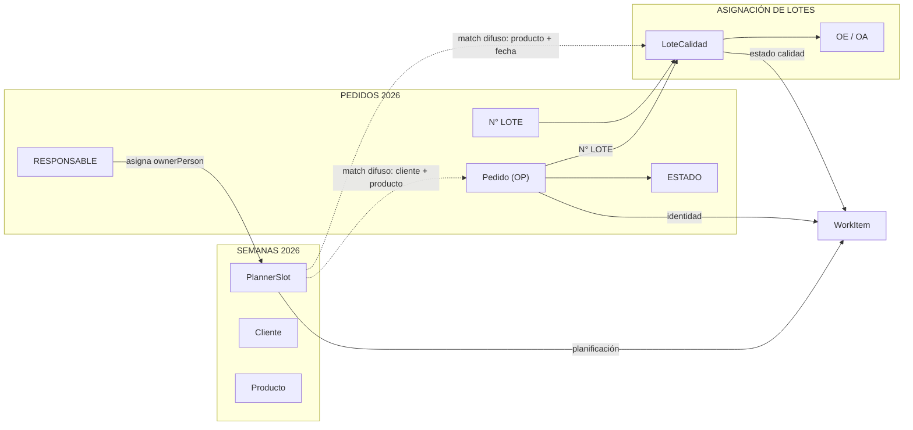

# 30 — Análisis del parser del laboratorio (pre-implementación)

> **Estado:** Propuesta para aprobación — **sin código implementado**  
> **Fecha:** 2026-07-03  
> **Contexto:** Los Excel compartidos son **referencia estructural únicamente**. La fuente de verdad operativa sigue siendo **Google Sheets en vivo** vía Drive.

---

## Resumen ejecutivo

Genus OS hoy interpreta SEMANAS 2026 como si fuera una tabla con filas de datos y headers. Eso contradice cómo el laboratorio realmente usa la planilla: es un **planner operativo visual** con bloques por persona, sector y semana, organizado en **columnas = días**.

La arquitectura correcta no es `SEMANAS → WorkItem`. Es:

```text
PEDIDOS 2026          →  Entidad Pedido (+ Dashboard KPIs)
SEMANAS 2026          →  Planner Operativo (slots de trabajo)
ASIGNACIÓN DE LOTES   →  Estado de Calidad por lote
                              ↓
                         WorkItem unificado (join + resolución)
```

Este documento describe cómo interpretar cada archivo, qué entidades extraer, cómo relacionarlas, qué fallaba el parser actual y qué estrategia implementar **después** de aprobación.

---

## 1. Cómo interpretar cada archivo

### 1.1 SEMANAS 2026 — Planner operativo (NO tabla)

**Pestañas observadas:** `ELABORACION`, `ACONDICIONAMIENTO`, `ENTREGAS`, `QACONDDIA`, `DB`

Cada pestaña cumple un rol distinto. Solo las tres primeras alimentan planificación operativa diaria; `QACONDDIA` y `DB` son seguimiento/KPIs embebidos dentro del mismo archivo.

#### Modelo mental correcto

| Concepto | Descripción |
|----------|-------------|
| **Unidad de lectura** | Bloque visual, no fila |
| **Eje temporal** | Columnas pares (2, 4, 6, 8, 10) = Lunes → Viernes |
| **Repetición** | El bloque semanal se repite verticalmente (semana 1, semana 2, …) |
| **Separadores** | Filas vacías, títulos de mes, encabezados de día, nombres de persona/sector |
| **Contenido** | Pilas verticales dentro de cada columna-día: Cliente → Producto → Cantidad |

#### ELABORACION

Estructura por **semana**:

```text
Fila A:  Lunes | Martes | Miércoles | Jueves | Viernes     ← encabezado días
Fila B:  16    | 17     | 18        | 19     | 20          ← número de día
Fila C:  Febrero (repetido por columna)                      ← mes
Fila D:  CRISTIAN                                            ← inicio bloque persona
         ... trabajo apilado por columna-día ...
Fila N:  NICOLAS                                             ← inicio bloque persona
         ... trabajo apilado por columna-día ...
[filas vacías]
[repite bloque semanal]
```

**Encargado organizacional:** Santino Gianfilippo es el responsable del sector Elaboración. En la planilla no aparece como fila de bloque; las ramas operativas visibles son **CRISTIAN** y **NICOLÁS**. El parser debe modelar:

- `sectorLead`: Santino (metadata de sector, no fila del sheet)
- `branchOwner`: Cristian / Nicolás (detectado por fila-título de bloque)

**Dentro de cada columna-día**, una tarea típica ocupa 2–4 filas consecutivas en la misma columna:

```text
Col 6 (Miércoles):
  R5: LAB ONCE          ← cliente / marca
  R6: SERUM AH+NIA      ← producto / descripción
  R7: 55KG              ← cantidad
```

A veces el cliente aparece en una fila y el producto en la siguiente **sin repetir cliente** (continuación del mismo slot). También hay filas con solo cantidad o solo producto secundario (ej. “MIXOLOGI DESVITAL” debajo de otro producto en la misma columna).

#### ACONDICIONAMIENTO (Envasado)

Misma grilla semanal por columnas-día, pero con **sub-sectores** explícitos:

| Bloque visual | Significado operativo |
|---------------|----------------------|
| `ENVASADO CONSUMO MASIVO` | Sector Envasado Masivo |
| `ENVASADO PRODUCTOS PREMIUN` | Sector Envasado Premium (typo real en planilla) |

Estos títulos aparecen en celdas sueltas (a menudo columna Martes) y delimitan **todo el trabajo posterior** hasta el siguiente bloque o la siguiente semana.

**Importante:** No existen filas `LÍNEA 1`, `LÍNEA 2`, `PREMIUM A` en la planilla real. El trabajo se organiza por **cliente + producto + cantidad apilados por día**, no por línea física numerada. La “línea” operativa es implícita: el operario del sector (Francisco/Belén en la app) ve su cola por día, no por “Línea 3”.

Hay anotaciones operativas mezcladas (`VIDEOS NATCEUTCALS!!`, `YOUTHFUL VIDEOS!!`, `HACER VIDEOS DE YOUTHFUL!!`) que son **notas**, no entidades.

#### ENTREGAS

**Sí es tabular** dentro del mismo archivo:

| Columna | Campo |
|---------|-------|
| FECHA | Fecha de entrega |
| CLIENTE | Cliente |
| PRODUCTO | Producto |
| CANTIDAD | Cantidad (puede ser `PARCIAL`) |

Algunas filas omiten fecha (heredan contexto del día anterior). Es un calendario de despachos, no el planner de producción.

#### QACONDDIA

Registro diario de calidad en acondicionamiento. Bloques por mes (`FEBRERO 2026`) con header repetido:

| FECHA | PRODUCTO | CANTIDAD | RESPONSABLE |

Las filas sin fecha pertenecen al mismo día que la fila anterior con fecha. Producto suele incluir cliente embebido (`CAV SHAMPOO`, `ALL BEAUTY CREMA HIDRATANTE`).

#### DB

Dashboard embebido de productividad de envasado (totales masivo/premium, rankings por operario). **No es fuente de WorkItems**; es KPI visual del archivo SEMANAS, distinto del Dashboard de PEDIDOS.

---

### 1.2 PEDIDOS 2026 — Fuente administrativa y comercial

**Pestañas observadas:** `PEDIDOS`, `ELABORACION`, `EXPEDICION`, `INGRESOS`, `KPI`, `Dashboard`, `CALCULOS_CLIENTES`

Este archivo **sí** está mucho más cerca de un modelo relacional. Es la **fuente de verdad** para identidad comercial, estado administrativo y KPIs oficiales.

#### Pestaña PEDIDOS (tabla principal)

| Columna | Rol |
|---------|-----|
| OP | Identificador único de pedido (ej. 25293) |
| Fecha | Fecha de ingreso |
| N° OC | Orden de compra del cliente |
| CLIENTE | Cliente |
| PRODUCTO | Producto |
| S | Sector (`P` = Premium, `M` = Masivo) |
| Q | Cantidad pedida |
| Ml | Volumen unitario |
| ESTADO | Estado comercial (`entregado`, en proceso, etc.) |
| N° LOTE | Lote asignado (cuando existe) |

Un OP puede tener **múltiples filas** (ej. OP 25300 → varios aceites MERMER con lotes E26087–E26092).

#### Pestaña ELABORACION (seguimiento de granel)

Tabla con responsable de elaboración y lote:

| Fecha | N° OC | CLIENTE | PRODUCTO | KG | ESTADO | Graneles | RESPONSABLE | FECHA | N°LOTE | OBSERVACIONES |

Aquí vive la asignación **Cristian / Nicolás / Santino** a nivel de pedido-lote, no en SEMANAS.

#### Pestaña EXPEDICION

Seguimiento logístico: cantidad pedida vs envasada, nivel de servicio por línea, remito, estado de entrega.

#### Pestaña KPI

Lead time y nivel de servicio **por pedido-lote** — insumo del Dashboard, no para recalcular en frontend.

#### Pestaña Dashboard

**KPIs oficiales del laboratorio.** Ejemplos observados:

| KPI | Valor ejemplo | Objetivo |
|-----|---------------|----------|
| Nivel de Servicio | 98.27% | ≥ 97% |
| Pedidos sin Reclamos | 100% | > 95% |
| Lead Time Promedio | 26.25 días | ≤ 25 días |
| Pedidos Activos | 83 | — |
| Entregados (año) | 329 | — |
| En Despacho | 8 | — |
| Consumo Masivo (unidades) | 450,533 | — |
| Productos Premium (unidades) | 159,203 | — |

Genus OS debe **leer estos valores del sheet**, no recomputarlos en Next.js.

---

### 1.3 ASIGNACIÓN DE LOTE 2025 — Referencia histórica

**Pestañas:** una por mes (ENERO–DICIEMBRE, con gaps posibles).

Estructura estable desde 2025:

| Columna | Descripción |
|---------|-------------|
| N° LOTE | Identificador (prefijo + año + secuencia) |
| FECHA | Fecha de asignación |
| PRODUCTO | Producto |
| CODIGO | Variante / código |
| MARCA | Marca / cliente |
| CANTIDADES | Cantidad |
| VTO | Vencimiento |
| FECHA ANALISIS | Fecha de análisis |
| N° ANALISIS | Número de análisis |
| OE | Orden de elaboración |
| OA | Orden de acondicionamiento |
| REG LIB | Registro libreta sanitaria |
| MUESTRAS MUSEO | Muestras museo |

Fila especial recurrente: `AGUA DEL SECTOR DE ELABORACION` (control de agua, no lote productivo).

**Uso:** aprender convenciones de columnas y relaciones históricas. **No** usar como fuente de datos en producción.

---

### 1.4 ASIGNACIÓN DE LOTES 2026 — Fuente de Calidad (estructura actual)

**Pestañas:** ENERO–JUNIO (crece mes a mes).

Evolución respecto a 2025:

| 2025 | 2026 | Notas |
|------|------|-------|
| CANTIDADES | CANTIDAD | Renombre |
| REG LIB | RL | Abreviado |
| MUESTRAS MUSEO | — | Ya no en header principal |
| — | MM | Módulo / ubicación (ej. “CAJA 2 Y 10”) |
| — | OBSERVACION | Notas de calidad |

Prefijos de lote observados (primera letra = tipo):

| Prefijo | Interpretación operativa (inferida) |
|---------|-------------------------------------|
| E | Elaboración |
| F | Formula / producto terminado fluido |
| M | Masivo |
| A, Y, J | Otros tipos presentes en datos |

El lote es la **clave de unión** entre PEDIDOS (`N° LOTE`), PEDIDOS/ELABORACION (`N°LOTE`) y ASIGNACIÓN DE LOTES (`N° LOTE`).

---

## 2. Bloques detectables por archivo

### SEMANAS 2026

| Tipo de bloque | Señales de detección | Contenido |
|----------------|---------------------|-----------|
| **Semana** | Fila `Lunes…Viernes` + fila numérica + fila mes | Delimita rango vertical |
| **Día** | Columna bajo encabezado de día | Slot temporal concreto |
| **Persona (Elaboración)** | Fila con 1 celda de texto en col 2: `CRISTIAN`, `NICOLAS` | Todo hasta la siguiente persona o semana |
| **Sector Envasado** | `ENVASADO CONSUMO MASIVO` / `ENVASADO PRODUCTOS PREMIUN` | Todo hasta siguiente sector o semana |
| **Slot de trabajo** | Pilas Cliente→Producto→Cantidad en una columna-día | Unidad mínima planificable |
| **Nota operativa** | Texto con `!!`, MAYÚSCULAS exclamativas, “VIDEOS” | Metadata, no entidad |
| **Separador** | Fila completamente vacía | Ignorar |
| **Tabla ENTREGAS** | Header `FECHA\|CLIENTE\|PRODUCTO\|CANTIDAD` | Filas tabulares |
| **Bloque QACONDDIA** | Título mes + header repetido | Entradas diarias calidad |

### PEDIDOS 2026

| Bloque | Detección | Contenido |
|--------|-----------|-----------|
| **Tabla PEDIDOS** | Header fila 1 con `OP` | Entidades Pedido |
| **Tabla ELABORACION** | Header con `RESPONSABLE`, `N°LOTE` | Seguimiento granel |
| **Tabla EXPEDICION** | Header con `Q envasada`, `N° REMITO` | Logística |
| **Dashboard KPI** | Texto `DASHBOARD OPERATIVO`, celdas con objetivos | KPIs oficiales |
| **KPI por pedido** | Tab KPI | Lead time / nivel servicio |

### ASIGNACIÓN DE LOTES

| Bloque | Detección | Contenido |
|--------|-----------|-----------|
| **Mes** | Pestaña ENERO, FEBRERO… | Scope temporal |
| **Header** | Fila 2 con `N° LOTE` | Schema de columnas |
| **Lote productivo** | Celda col B matching `/^[A-Z]\d{5,}/` | Entidad Lote |
| **Control agua** | Texto `AGUA DEL SECTOR DE ELABORACION` | Registro especial (excluir de cola calidad productiva o tratar aparte) |

---

## 3. Entidades obtenidas

### Desde PEDIDOS → `Pedido`

```typescript
// Conceptual — no implementado aún
Pedido {
  op: string              // "25293"
  fechaIngreso: Date
  oc: string | null
  cliente: string
  producto: string
  sector: "M" | "P" | null
  cantidadPedida: number
  volumenMl: number | null
  estado: string          // "entregado", etc.
  lote: string | null     // "F26021"
}
```

Extensiones por pestaña:

- `PedidoElaboracion` — responsable, kg, fecha elaboración, observaciones
- `PedidoExpedicion` — qEnvasada, nivelServicio, remito, fecha entrega
- `DashboardKPI` — snapshot de celdas del Dashboard (no derivado)

### Desde SEMANAS → `PlannerSlot`

```typescript
PlannerSlot {
  id: string                    // derivado: semana + día + columna + índice
  sector: "ELABORACION" | "ENVASADO_MASIVO" | "ENVASADO_PREMIUM"
  weekStart: Date | null        // inferido del bloque semanal
  dayOfWeek: "lunes" | ... | "viernes"
  dayDate: Date | null          // número + mes del bloque
  branchOwner: string | null    // Cristian, Nicolás (elaboración)
  packagingTier: "masivo" | "premium" | null
  cliente: string | null
  producto: string | null
  cantidad: string | null       // "55KG", "900 x100ml", "6400"
  notas: string | null
  sourceRange: string           // referencia al sheet
}
```

**No** es un WorkItem todavía. Es planificación visual sin OP ni estado administrativo.

### Desde ASIGNACIÓN DE LOTES → `LoteCalidad`

```typescript
LoteCalidad {
  numeroLote: string            // "E26001"
  fecha: Date
  producto: string
  codigo: string | null
  marca: string | null
  cantidad: number | null
  vencimiento: Date | null
  modulo: string | null         // MM
  fechaAnalisis: Date | null
  numeroAnalisis: string | null
  oe: string | null
  oa: string | null
  rl: string | null
  observacion: string | null
  mes: string                   // pestaña origen
}
```

### Entrega derivada (SEMANAS/ENTREGAS o PEDIDOS/EXPEDICION)

`EntregaProgramada` — fecha, cliente, producto, cantidad — útil para Depósito pero secundaria al join principal.

---

## 4. Relaciones entre archivos



### Claves de unión (prioridad)

| Prioridad | Clave | Confianza |
|-----------|-------|-----------|
| 1 | `N° LOTE` exacto entre PEDIDOS ↔ LOTES | Alta |
| 2 | OP + producto (PEDIDOS multi-fila) | Alta |
| 3 | Cliente + producto normalizado (SEMANAS ↔ PEDIDOS) | Media |
| 4 | Producto + ventana de fechas (SEMANAS slot ↔ PEDIDOS/ELABORACION) | Media-baja |
| 5 | OE/OA en LOTES ↔ refs en otros sheets | Media (cuando existen) |

### Reglas de negocio observadas

1. **SEMANAS planifica; PEDIDOS autoriza.** Un slot en SEMANAS sin OP match es trabajo planificado aún no vinculado comercialmente.
2. **PEDIDOS/ELABORACION define responsable** de granel; SEMANAS refuerza la vista semanal por persona.
3. **LOTES es downstream:** un WorkItem entra a Calidad cuando existe lote en ASIGNACIÓN, no cuando aparece en SEMANAS.
4. **Dashboard KPIs solo desde PEDIDOS/Dashboard** — SEMANAS/DB es otro dashboard (productividad envasado), no reemplaza al oficial.

---

## 5. Construcción del WorkItem unificado

### Pipeline propuesto

```text
1. ParsePedidos()        → Pedido[]
2. ParsePlanner()        → PlannerSlot[]
3. ParseLotes()          → LoteCalidad[]
4. ResolveMatches()      → MatchGraph
5. BuildWorkItems()      → WorkItem[]
```

### WorkItem resultante

El WorkItem es la **vista operativa unificada** para `/mi-trabajo`, no una fila cruda de ningún sheet.

| Campo WorkItem | Fuente primaria | Fuente secundaria |
|----------------|-----------------|-------------------|
| `id` | Derivado estable: `op:lote:slot` o hash de match | — |
| `pedidoRef` (OP) | PEDIDOS | — |
| `client`, `product` | PEDIDOS | SEMANAS (si no hay OP) |
| `quantity`, `unit` | PEDIDOS | SEMANAS slot |
| `status` | PEDIDOS.estado + estado app | LOTES (calidad) |
| `ownerPerson` | PEDIDOS/ELABORACION.responsable | SEMANAS.branchOwner |
| `sector` | PEDIDOS.S (M/P) + reglas | SEMANAS.sector |
| `loteRef` | PEDIDOS / LOTES | — |
| `oeRef`, `oaRef` | LOTES | PEDIDOS |
| `date`, `dayLabel` | SEMANAS PlannerSlot | PEDIDOS fechas |
| `deliveryDate` | PEDIDOS/EXPEDICION | SEMANAS/ENTREGAS |
| `originStage` | Inferido del sector + lote | — |
| `confidence` | Según calidad del match | — |
| `source` | `pedidos_2026` \| `semanas_2026` \| `asignacion_lotes_2026` | — |

### Casos por sector

| Sector | WorkItems principales | Fuentes |
|--------|----------------------|---------|
| Elaboración (Cristian/Nicolás) | Slots de la semana + OP vinculado | SEMANAS + PEDIDOS/ELABORACION |
| Envasado Masivo/Premium | Slots por día + OP | SEMANAS + PEDIDOS |
| Calidad | Lotes pendientes de análisis | LOTES (+ join PEDIDOS) |
| Depósito | Entregas programadas | SEMANAS/ENTREGAS o EXPEDICION |
| Producción | Agregación cross-sector | Todos (vista, no re-parse) |

### Estados Calidad desde LOTES

Campos `FECHA ANALISIS`, `N° ANALISIS`, `OE`, `OA`, `RL`, `OBSERVACION` permiten inferir:

- `pendiente_analisis` — sin fecha análisis / N/A
- `en_analisis` — fecha análisis reciente sin RL
- `aprobado` / `observado` — según OE/OA/RL/OBSERVACION (requiere validar con el lab reglas exactas)

---

## 6. Errores del parser actual

Basado en `semanas-block-parser.ts`, `semanas-to-work-items.ts` y `work-items.service.ts`:

### 6.1 Arquitectura

| Error | Impacto |
|-------|---------|
| **Solo SEMANAS alimenta WorkItems** | OP, estado, lote y responsable administrativo se pierden o se inventan |
| **PEDIDOS indexado pero no mapeado** | `work-items.service` admite `pedidos_2026: true` pero count = 0 |
| **LOTES no integrado** | Calidad sin fuente real |
| **KPIs recalculados o ausentes** | Dashboard de PEDIDOS ignorado |

### 6.2 SEMANAS — modelo de datos

| Error | Detalle |
|-------|---------|
| **Asume filas horizontales** | Usa `recordFromSemanasRow(headers, row)` — cliente col 0, producto col 1 |
| **Ignora grilla columnar** | El trabajo vive en columnas 2/4/6/8/10, apilado verticalmente |
| **Busca tab `SEMANAS`** | El archivo real tiene tabs por sector: `ELABORACION`, `ACONDICIONAMIENTO`, … |
| **Solo escanea 1 tab** | `discoverSemanasFile` usa un solo tab, no todas las pestañas operativas |
| **Detecta bloques por keyword en fila** | `detectSemanasBlocks` busca “elaboración/envasado” en filas — no existen esos títulos dentro de tabs ya nombradas |
| **Espera headers de tabla** | `looksLikeHeaderRow` busca cliente/producto/cantidad en una fila — no existen en planner |
| **Líneas LÍNEA 1/2/3** | F10.1 documenta líneas que **no están en la planilla real** |
| **Posicional fallback incorrecto** | `buildPositionalRecord`: cells[0]=cliente, [1]=producto — inválido para layout por columnas |

### 6.3 PEDIDOS — mapper roto

`pedido.mapper.ts` busca campo `pedidoId` pero la columna real es **`OP`**. Resultado: `listPedidos()` devuelve array vacío aunque el sheet esté conectado.

### 6.4 Matching

| Error | Detalle |
|-------|---------|
| **Sin join SEMANAS↔PEDIDOS** | Cada WorkItem es huérfano de OP |
| **status hardcodeado** | Siempre `"pendiente"` en mapper SEMANAS |
| **pedidoRef desde columnas inexistentes** | pickField `op`, `pedido` en filas que no tienen OP |

### 6.5 Discovery / UX

- Mensajes dicen “desde SEMANAS 2026” aunque el sector necesite PEDIDOS o LOTES
- Calidad explícitamente excluida: *“Calidad no recibe WorkItems desde SEMANAS en F8.1”*
- Production overview construido solo desde SEMANAS → datos incompletos

---

## 7. Estrategia de parsing a implementar (post-aprobación)

### Fase A — Parsers especializados (sin mezclar responsabilidades)

| Módulo | Input | Output |
|--------|-------|--------|
| `pedidos-parser` | Tab PEDIDOS + ELABORACION + EXPEDICION | `Pedido[]`, `PedidoElaboracion[]` |
| `pedidos-dashboard-parser` | Tab Dashboard + KPI | `DashboardSnapshot` (celdas fijas por layout, no SQL) |
| `planner-parser` | Tabs ELABORACION + ACONDICIONAMIENTO | `PlannerSlot[]` |
| `planner-entregas-parser` | Tab ENTREGAS | `EntregaProgramada[]` |
| `lotes-parser` | Tabs mensuales | `LoteCalidad[]` |

Cada parser conoce **su** geometría. No comparten lógica de “fila = registro” excepto donde realmente hay tabla.

### Fase B — Planner parser (corazón del cambio)

Algoritmo propuesto para ELABORACION / ACONDICIONAMIENTO:

```text
1. Escanear filas buscando ancla de semana: regex /Lunes.*Viernes/
2. Leer mapa columnas-día desde fila ancla (col → día semana)
3. Leer fila numérica + fila mes → construir fecha parcial
4. Dentro del rango [ancla .. próxima ancla):
   a. Si fila = PERSONA (1 celda texto col 2, uppercase nombre) → ctx.branchOwner
   b. Si fila = SECTOR ENVASADO → ctx.packagingTier
   c. Si fila = nota operativa → adjuntar a ctx.lastSlot.notes
   d. Para cada celda no vacía en columnas-día:
      - Clasificar celda: CLIENTe | PRODUCTO | CANTIDAD | NOTA
      - Usar heurísticas: cantidad = /\d+\s*(KG|kg|ml|x\d+|^\d+$)/ 
      - Apilar en slot abierto de esa columna-día
5. Cerrar slots al cambiar semana/persona/sector
```

**No depender de merges** inicialmente, pero leer `mergesByTab` del meta de Sheets para confirmar bloques visuales cuando Google los exponga.

### Fase C — Resolución / join

```text
1. Index pedidosByLote: Map<lote, Pedido[]>
2. Index pedidosByClienteProducto: Map<normalizedKey, Pedido[]>
3. Para cada PlannerSlot:
   - Intentar match por lote si cantidad/notas mencionan lote
   - Else match cliente+producto normalizado (fuzzy)
   - Else dejar slot huérfano con confidence=low
4. Para cada LoteCalidad:
   - Buscar Pedido por lote
   - Emitir WorkItem sector=CALIDAD
5. Deduplicar: un OP + lote + día → un WorkItem
```

Normalización de texto: quitar acentos, uppercase, aliases conocidos (`TMCO` → `THE MINIMAL CO`, `TYL` → `THELMA Y LOUISE`).

### Fase D — Integración en WorkItemsService

```text
loadAllWorkItems():
  pedidos = parsePedidos()
  slots = parsePlanner()
  lotes = parseLotes()
  return buildUnifiedWorkItems(pedidos, slots, lotes)
```

Prioridad de fuentes en conflictos: **PEDIDOS > LOTES > SEMANAS**.

### Fase E — KPIs

- Endpoint `/api/v1/dashboard` lee tab Dashboard de PEDIDOS
- Celdas identificadas por **anclas de texto** (`NIVEL DE SERVICIO`, `LEAD TIME PROMEDIO`) + offset relativo
- Cache con TTL; invalidar en `/drive/refresh`
- **Prohibido** recalcular lead time o nivel de servicio en Next.js para la vista oficial

### Fase F — Validación

| Prueba | Criterio |
|--------|----------|
| Cristian@ | Ve slots de su bloque CRISTIAN con OP cuando match existe |
| masivo@ / premium@ | Ve slots filtrados por tier, no por “LÍNEA 1” |
| calidad@ | Ve lotes desde ASIGNACIÓN, no desde SEMANAS |
| Dashboard | Muestra mismos números que celda Dashboard en PEDIDOS |
| Debug | `sourcesMapped.pedidos_2026 > 0` |

### Principios invariantes

1. **Google Sheets = única fuente de datos en runtime**
2. **Excel de referencia = solo tests/fixtures estructurales** (opcional, no producción)
3. **No hardcodear filas, clientes ni productos**
4. **Parsers tolerantes a filas vacías, typos (`PREMIUN`) y notas libres**
5. **WorkItem = proyección**, nunca copia literal de una fila

---

## Apéndice A — Mapa de pestañas vs. rol en Genus OS

| Archivo | Pestaña | Rol en Genus OS |
|---------|---------|-----------------|
| SEMANAS | ELABORACION | PlannerSlot elaboración |
| SEMANAS | ACONDICIONAMIENTO | PlannerSlot envasado |
| SEMANAS | ENTREGAS | EntregaProgramada |
| SEMANAS | QACONDDIA | Referencia calidad diaria (fase 2) |
| SEMANAS | DB | KPI envasado local (no reemplaza Dashboard PEDIDOS) |
| PEDIDOS | PEDIDOS | Entidad Pedido |
| PEDIDOS | ELABORACION | Responsable + lote granel |
| PEDIDOS | EXPEDICION | Logística |
| PEDIDOS | Dashboard | **KPIs oficiales** |
| PEDIDOS | KPI | Detalle por pedido |
| LOTES | ENERO… | LoteCalidad |

---

## Apéndice B — Preguntas abiertas para validar con el lab

Antes de implementar, confirmar:

1. ¿Santino debe aparecer como `ownerPerson` en slots de Cristian/Nicolás o solo como metadata de sector?
2. ¿Reglas exactas de estado calidad según OE/OA/RL?
3. ¿Aliases oficiales cliente (`TMCO`, `TYL`, etc.) — hay tabla de abreviaturas?
4. ¿Un slot SEMANAS sin OP match debe mostrarse igual (trabajo interno/muestras)?
5. ¿QACONDDIA entra en Fase 1 o es fase posterior?

---

## Siguiente paso

**Esperar aprobación de este documento.** Una vez aprobado:

1. Implementar parsers especializados sobre Google Sheets reales
2. Reemplazar pipeline `loadSemanasWorkItems`-only
3. Corregir `pedido.mapper` (columna OP)
4. Agregar tests con fixtures estructurales derivados de estos Excel (sin leer uploads en runtime)
